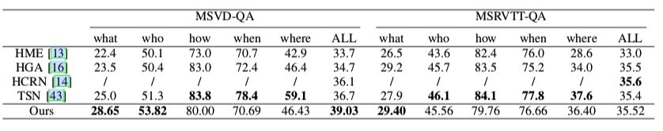

# A Video Question Answering Model Based on Knowledge Distillation
We propose a novel multimodal knowledge distillation method that leverages the strengths of knowledge distillation for model compression and feature enhancement. Specifically, the fused features in the larger teacher model are distilled into knowledge, which guides the learning of appearance and motion features in the smaller student model. By incorporating cross-modal information in the early stages, the appearance and motion features can discover their related and complementary potential relationships, thus improving the overall model performance.

Illustrations of base architecture and the whole framework of knowledge distillation for VideoQA:

Base Architecture            |  Framework of Knowledge Distillation
:-------------------------:|:-------------------------:
  |  

## Dataset
-Download [MSRVTT-QA, MSVD-QA](https://github.com/xudejing/video-question-answering) dataset and edit absolute paths in `preprocess/preprocess_features.py` and `preprocess/preprocess_questions.py` upon where you locate your data.

## Our Final Performance on each dataset
Comparison with SoTA on MSVD-QA and MSRVTT-QA datasets


## Preprocessing input features

1. To extract appearance features:
```
python preprocess/preprocess_features.py --gpu_id 0 --dataset msvd --model resnet101 --num_clips {num_clips}
```
2. To extract motion features:

-Download ResNeXt-101 [pretrained model](https://drive.google.com/drive/folders/1zvl89AgFAApbH0At-gMuZSeQB_LpNP-M) (resnext-101-kinetics.pth) and place it to `data/preprocess/pretrained/`.
```
python preprocess/preprocess_features.py --dataset msvd --model resnext101 --image_height 112 --image_width 112 --num_clips {num_clips}
```
3. To extract textual features:

-Download [glove pretrained 300d word vectors](http://nlp.stanford.edu/data/glove.840B.300d.zip) to `data/glove/` and process it into a pickle file:
```
 python txt2pickle.py
```
-Process questions:
```
python preprocess/preprocess_questions.py --dataset msrvtt-qa --glove_pt data/glove/glove.840.300d.pkl --mode train
    
python preprocess/preprocess_questions.py --dataset msrvtt-qa --mode val
    
python preprocess/preprocess_questions.py --dataset msrvtt-qa --mode test
```

## Training
First, train the teacher model
```bash
python train.py --cfg configs/msvd_DualVGR_20.yml --alpha {alpha} --beta {beta} --unit_layers {unit_layers}
```
Then, train the student model
```bash
python train.py --cfg configs/msvd_DualVGR_20.yml --alpha {alpha} --beta {beta} --unit_layers {unit_layers}
```

## Evaluation
First, you have to set the correct file path. Then, to evaluate the trained model, run the following:
```bash
python validate.py --cfg configs/msvd_DualVGR_20.yml --unit_layers {unit_layers}
```
